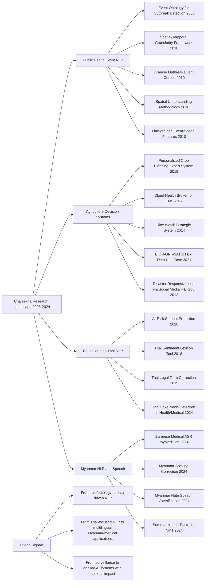

# Last Updated: 2026-04-05

# Diagram: Chanlekha Research Landscape (2008-2024)

```mermaid
flowchart LR
    A[Chanlekha Research Landscape 2008-2024]
    A --> B[Public Health Event NLP]
    A --> C[Agriculture Decision Systems]
    A --> D[Education and Thai NLP]
    A --> E[Myanmar NLP and Speech]

    B --> B1[Event Ontology for Outbreak Detection 2008]
    B --> B2[Spatial/Temporal Granularity Framework 2010]
    B --> B3[Disease Outbreak Event Corpus 2010]
    B --> B4[Spatial Understanding Methodology 2010]
    B --> B5[Fine-grained Event-Spatial Features 2010]

    C --> C1[Personalized Crop Planning Expert System 2015]
    C --> C2[Cloud Health Broker for EMS 2017]
    C --> C3[Rice Watch Strategic System 2014]
    C --> C4[BIO-AGRI-WATCH Big Data Use Case 2021]
    C --> C5[Disaster Responsiveness via Social Media + E-Gov 2012]

    D --> D1[At-Risk Student Prediction 2018]
    D --> D2[Thai Sentiment Lexicon Tool 2018]
    D --> D3[Thai Legal Term Correction 2019]
    D --> D4[Thai Fake News Detection in Health/Medical 2024]

    E --> E1[Burmese Medical ASR myMediCon 2024]
    E --> E2[Myanmar Spelling Correction 2024]
    E --> E3[Myanmar Hate Speech Classification 2024]
    E --> E4[Summarize-and-Paste for NMT 2024]

    F[Bridge Signals]
    F --> G[From rule/ontology to data-driven NLP]
    F --> H[From Thai-focused NLP to multilingual Myanmar/medical applications]
    F --> I[From surveillance to applied AI systems with societal impact]
```
