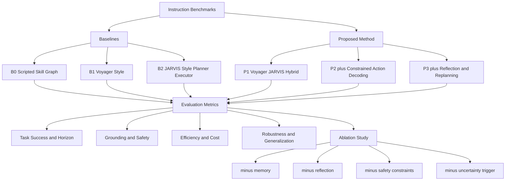

# Last Updated: 2026-04-04

# Diagram: Evaluation Framework for Minecraft NLP-Robotics Thesis

```mermaid
flowchart TD
    A[Instruction Benchmarks] --> B[Baselines]
    A --> C[Proposed Method]

    B --> B0[B0 Scripted Skill Graph]
    B --> B1[B1 Voyager Style]
    B --> B2[B2 JARVIS Style Planner Executor]

    C --> C1[P1 Voyager JARVIS Hybrid]
    C --> C2[P2 plus Constrained Action Decoding]
    C --> C3[P3 plus Reflection and Replanning]

    B0 --> D[Evaluation Metrics]
    B1 --> D
    B2 --> D
    C1 --> D
    C2 --> D
    C3 --> D

    D --> D1[Task Success and Horizon]
    D --> D2[Grounding and Safety]
    D --> D3[Efficiency and Cost]
    D --> D4[Robustness and Generalization]

    D --> E[Ablation Study]
    E --> E1[minus memory]
    E --> E2[minus reflection]
    E --> E3[minus safety constraints]
    E --> E4[minus uncertainty trigger]
```
