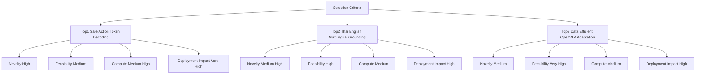

# Last Updated: 2026-04-04

# Diagram: Top 3 NLP+Robotics Thesis Picks

```mermaid
flowchart TD
    A[Selection Criteria] --> B[Top1 Safe Action Token Decoding]
    A --> C[Top2 Thai English Multilingual Grounding]
    A --> D[Top3 Data Efficient OpenVLA Adaptation]

    B --> B1[Novelty High]
    B --> B2[Feasibility Medium]
    B --> B3[Compute Medium High]
    B --> B4[Deployment Impact Very High]

    C --> C1[Novelty Medium High]
    C --> C2[Feasibility High]
    C --> C3[Compute Medium]
    C --> C4[Deployment Impact High]

    D --> D1[Novelty Medium]
    D --> D2[Feasibility Very High]
    D --> D3[Compute Medium]
    D --> D4[Deployment Impact High]
```
