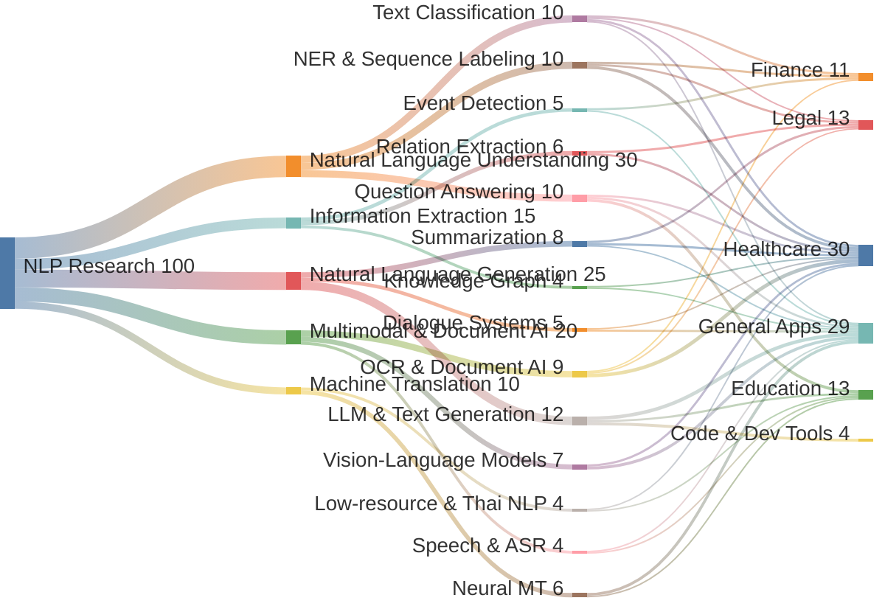

# NLP Scope Overview — Sankey Graph
# Last Updated: 2026-04-29

## โครงสร้าง 3 ชั้น

| ชั้น | หมวด | คำอธิบาย |
|------|------|-----------|
| 1 | NLP Research | จุดเริ่มต้น — งานวิจัย NLP ทั้งหมด |
| 2 | Core Areas | 5 กลุ่มหลัก (NLU, NLG, IE, Multimodal, MT) |
| 3 | Tasks | งานย่อยใต้แต่ละกลุ่ม (QA, OCR, NER, ฯลฯ) |
| 4 | Domains | ด้านการประยุกต์ใช้ (Healthcare, Legal, Finance, Education, General) |

## หมายเหตุ
- **ความกว้างของเส้น** = สัดส่วนความสำคัญ/ปริมาณงานวิจัย (ตัวเลขเชิงสัมพัทธ์)
- **OCR & Document AI** → Healthcare เป็นเส้นหลักของโปรเจกต์นี้ (Thai Medical OCR Pipeline)
- **Low-resource & Thai NLP** แยกออกมาเพื่อเน้น context ภาษาไทย
