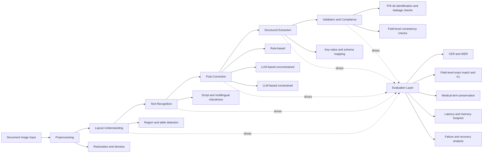

# Last Updated: 2026-04-05

# Diagram: OCR Research Landscape (2026)

## Notes
- Synthesized from OCR-related source summaries and topic notes currently indexed in this workspace.
- Designed as a broad context map for selecting OCR research direction and evaluation strategy.
