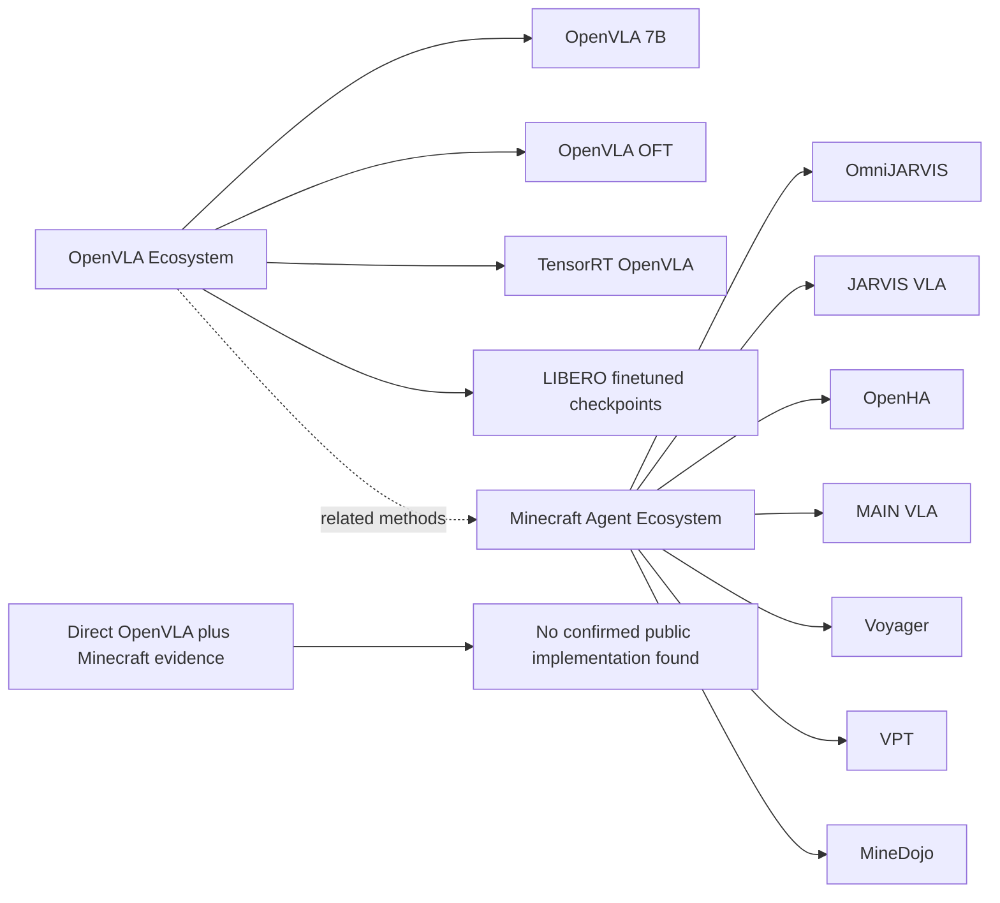

# Last Updated: 2026-04-04

# Diagram: OpenVLA and Minecraft Landscape

```mermaid
flowchart LR
    A[OpenVLA Ecosystem] --> A1[OpenVLA 7B]
    A --> A2[OpenVLA OFT]
    A --> A3[TensorRT OpenVLA]
    A --> A4[LIBERO finetuned checkpoints]

    B[Minecraft Agent Ecosystem] --> B1[OmniJARVIS]
    B --> B2[JARVIS VLA]
    B --> B3[OpenHA]
    B --> B4[MAIN VLA]
    B --> B5[Voyager]
    B --> B6[VPT]
    B --> B7[MineDojo]

    C[Direct OpenVLA plus Minecraft evidence] --> C1[No confirmed public implementation found]
    A -. related methods .-> B
```
