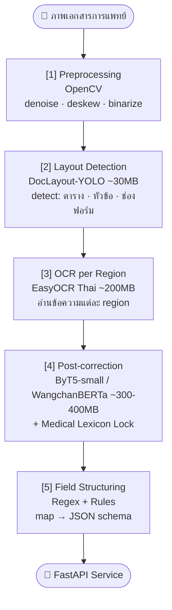

# Last Updated: 2026-03-31

# Diagram: Thai Medical OCR — Modular Lightweight Pipeline

## Notes
- รวม ~930 MB (เบากว่า VLM เดี่ยว 5-10x)
- ขั้นตอนที่ 2 Layout Detection คือ bottleneck หลัก — detect region ถูกแล้วที่เหลือง่าย
- WangchanBERTa มาจาก NECTEC/VISTEC เหมาะกับ context ภาษาไทยทางการแพทย์
- ByT5-small ทำงานระดับ character ไม่ต้อง word tokenizer

## Related
- Topic: [/research/topics/thai-medical-ocr-post-correction.md](/research/topics/thai-medical-ocr-post-correction.md)
- Experiment Plan: [/research/ideas/experiment-plan-thai-medical-ocr-2026-03-31.md](/research/ideas/experiment-plan-thai-medical-ocr-2026-03-31.md)
- See also: [system-comparison-ocr-abcd.md](system-comparison-ocr-abcd.md)
