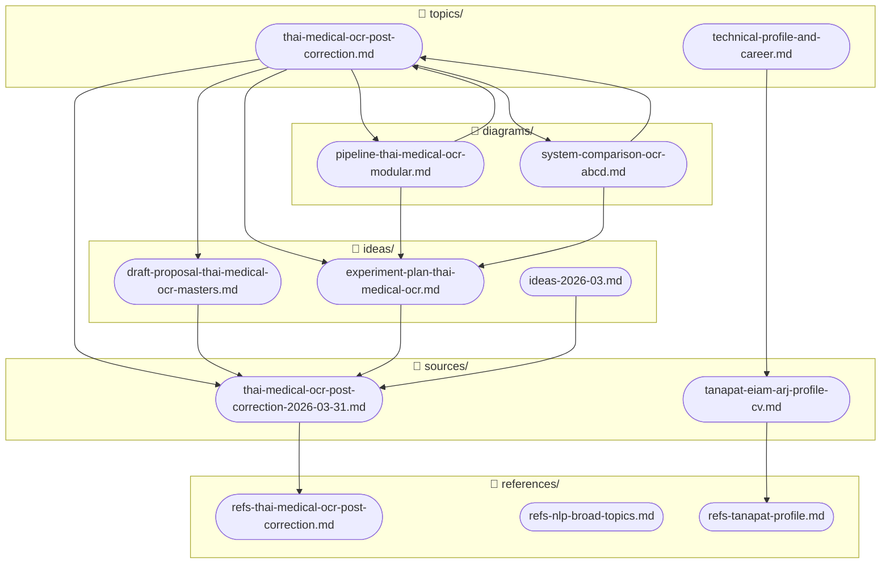

# Last Updated: 2026-03-31

# Diagram: Research File Link Map

## Notes
- อัปเดต diagram นี้ทุกครั้งที่เพิ่มไฟล์ใหม่เข้า research/
- refs-nlp-broad-topics.md ยังไม่มี topic เชื่อมโยง (orphan) — เป็น reference กลางที่ยังไม่ผูกกับ topic เฉพาะ
