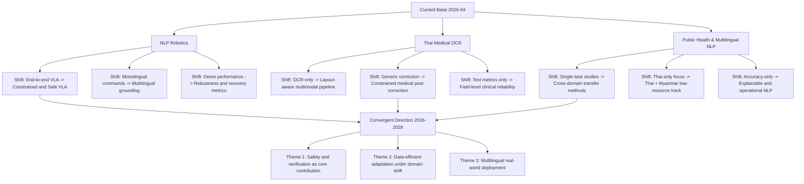

# Last Updated: 2026-04-05

# Diagram: Research Trend Outlook (2026-2028)

## Notes
- Synthesized from topic files and ideas indexed in this workspace as of 2026-04-05.
- Intended as a direction map for selecting thesis-level contributions.
