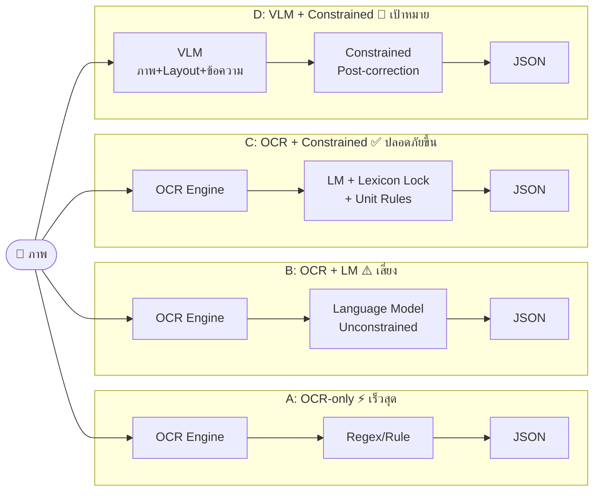

# Last Updated: 2026-03-31

# Diagram: Thai Medical OCR — System Comparison (A vs B vs C vs D)

## Summary Table

| ระบบ | เข้าใจ Layout | ทนต่อ Noise | ปลอดภัย Medical Term | ความเร็ว |
|---|---|---|---|---|
| A: OCR-only | ❌ | ต่ำ | ✅ (ไม่แตะ) | เร็วสุด |
| B: OCR+LM | ❌ | ปานกลาง | ❌ เสี่ยง | ปานกลาง |
| C: OCR+Constrained | ❌ | ปานกลาง | ✅ | ปานกลาง |
| D: VLM+Constrained | ✅ | สูง | ✅ | ช้ากว่า แต่แม่นกว่า |

## Related
- Topic: [../topics/thai-medical-ocr-post-correction.md](../topics/thai-medical-ocr-post-correction.md)
- Pipeline diagram: [pipeline-thai-medical-ocr-modular.md](pipeline-thai-medical-ocr-modular.md)
- Experiment Plan: [../ideas/experiment-plan-thai-medical-ocr-2026-03-31.md](../ideas/experiment-plan-thai-medical-ocr-2026-03-31.md)
