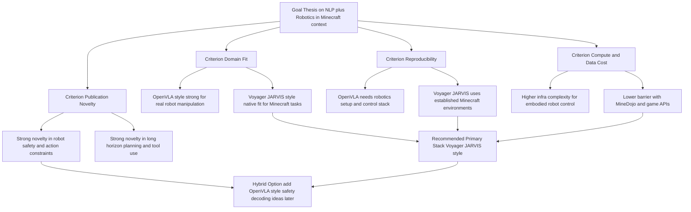

# Last Updated: 2026-04-04

# Diagram: Thesis Stack Decision OpenVLA vs Voyager/JARVIS

```mermaid
flowchart TD
    G[Goal Thesis on NLP plus Robotics in Minecraft context] --> C1[Criterion Domain Fit]
    G --> C2[Criterion Reproducibility]
    G --> C3[Criterion Compute and Data Cost]
    G --> C4[Criterion Publication Novelty]

    C1 --> O1[OpenVLA style strong for real robot manipulation]
    C1 --> V1[Voyager JARVIS style native fit for Minecraft tasks]

    C2 --> O2[OpenVLA needs robotics setup and control stack]
    C2 --> V2[Voyager JARVIS uses established Minecraft environments]

    C3 --> O3[Higher infra complexity for embodied robot control]
    C3 --> V3[Lower barrier with MineDojo and game APIs]

    C4 --> O4[Strong novelty in robot safety and action constraints]
    C4 --> V4[Strong novelty in long horizon planning and tool use]

    V1 --> R[Recommended Primary Stack Voyager JARVIS style]
    V2 --> R
    V3 --> R
    O4 --> H[Hybrid Option add OpenVLA style safety decoding ideas later]
    R --> H
```
