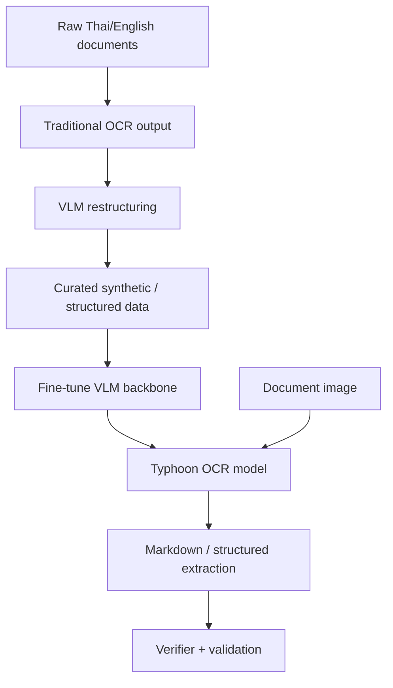
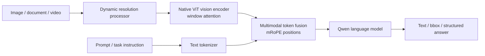
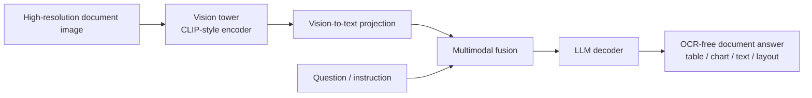

# Last Updated: 2026-05-06

# Diagram: VLM Thai OCR Architecture Map

## Modular OCR + VLM Fallback Architecture

```mermaid
flowchart LR
  A[Input Thai document image] --> B[Preprocess<br/>deskew denoise crop]
  B --> C[Layout detection<br/>DocLayout-YOLO]
  C --> D[OCR per region<br/>EasyOCR / PaddleOCR]
  D --> E[Post-correction<br/>ByT5 / WangchanBERTa]
  E --> F[Field extraction<br/>rules + schema]
  F --> G[Evaluation cascade<br/>CER + ANLS + BERTScore]
  G --> H{Verifier result}
  H -->|supported| I[Accept field JSON]
  H -->|unsupported / uncertain| J[VLM fallback<br/>Typhoon OCR / Qwen2.5-VL]
  J --> K[Evidence-grounded verifier]
  K --> I
  K -->|still uncertain| L[Human review]
```

## Typhoon OCR-Style Data Construction / Inference Architecture

## Qwen2.5-VL Conceptual Architecture

## mPLUG-DocOwl OCR-Free Architecture

## Source Links

- Typhoon OCR paper: <https://arxiv.org/abs/2601.14722>
- Typhoon OCR model card: <https://huggingface.co/typhoon-ai/typhoon-ocr-7b>
- Qwen2.5-VL technical report: <https://arxiv.org/abs/2502.13923>
- Qwen2.5-VL architecture notes: <https://deepwiki.com/QwenLM/Qwen2.5-VL/2-model-architecture>
- mPLUG-DocOwl system architecture: <https://deepwiki.com/X-PLUG/mPLUG-DocOwl/1.2-system-architecture>
- mPLUG-DocOwl 1.5: <https://arxiv.org/abs/2403.12895>
- mPLUG-DocOwl2: <https://arxiv.org/abs/2409.03420>

